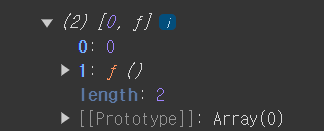
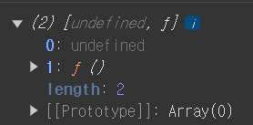

# State란?

## State란

현재 가지고 있는 형태나 모양을 정의한다. 즉 변화할 수 있는 동적인 값을 **State**라 한다.

React컴포넌트는 모두 자신의 **State를 정의 하고 있다.**

**_State는 컴포넌트의 현재 상태를 보관하는 변수이며 State의 값에 따라 렌더링 되는 UI가 결정된다. 이 때 변화된 State의 값을 재랜더링 하는 것을 "Re-Render" 또는 "Re-Rendering" 이라고 한다._**

---

## State 사용법

#### State 첫 번째 값

`import { useState } from 'react';`

React에 useState를 Import한 후

`const StateName = useState(초기 값);`으로 구성된다.

```jsx
import './App.css';
import { useState } from 'react';

function App() {
  const state = useState(0);
  console.log(state);
  return <></>;
}

export default App;
```



그림을 보면 state의 초기 값을 0으로 초기화 해주었기에 0으로 잘 있는 것을 볼 수 있다.
만약 초기 값을 정의하지 않을 경우



Undefinded로 정의 된다.

#### State 두 번째 값

State의 첫 번째 값이 상태 값이면 두 번째 는 무엇일까?

State의 두 번째 값은 바로 **_상태 변화 함수_** 다. 상태 변화 함수란 State의 값을 변경 할 때 사용되는 함수다.
